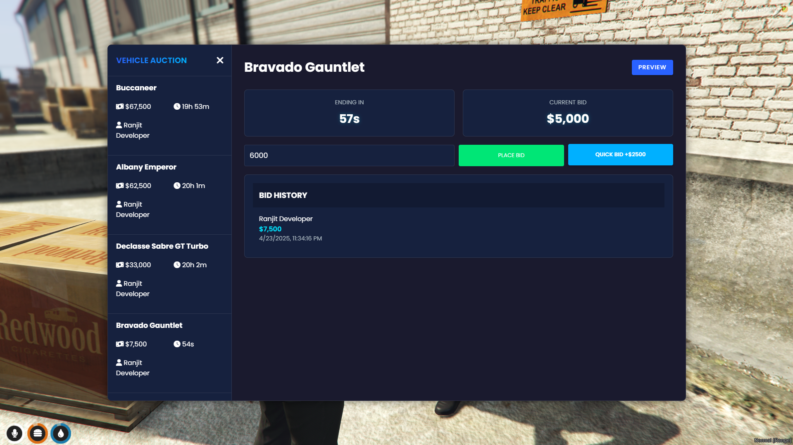

# Ranjit - Vehicle Auction Script for QB-Core



| If you are interested in joining my community: [Discord](https://discord.gg/TdDRdWpeJz) | For questions, join the Discord or add me: `ranjit_07` |

**Preview Video:** [Watch Here](https://youtu.be/mQ0ptMDeeX0?si=KzhaTZOiLZCrfbnK)


---

## Information

A script that allows players to participate in vehicle auctions. Players can bid on vehicles, preview them, and claim their winnings. Admins can create auctions with customizable starting bids and durations.

### Features:
- **Live Auctions**: Players can bid on vehicles in real-time.
- **Preview Mode**: Players can preview vehicles before bidding.
- **Claim System**: Winners can claim their vehicles after the auction ends.
- **Admin Tools**: Admins can create and manage auctions easily.
- **Discord Webhooks**: Notifications for auction events (e.g., bids, winners).


---

## Installation

1. **SQL Setup**: Import the SQL file provided to your database.
2. **Start the Script**: Add the following to your `server.cfg`:
   ```
   ensure Car
   ```
3. **Configuration**: Customize the script in `config.lua` to suit your server's needs.

---

## Commands

- `/createauction`: Admin command to create a new vehicle auction.

---

## Support

For any questions or issues, join the [Discord](https://discord.gg/TdDRdWpeJz) or contact me directly: `ranjit_07`.
